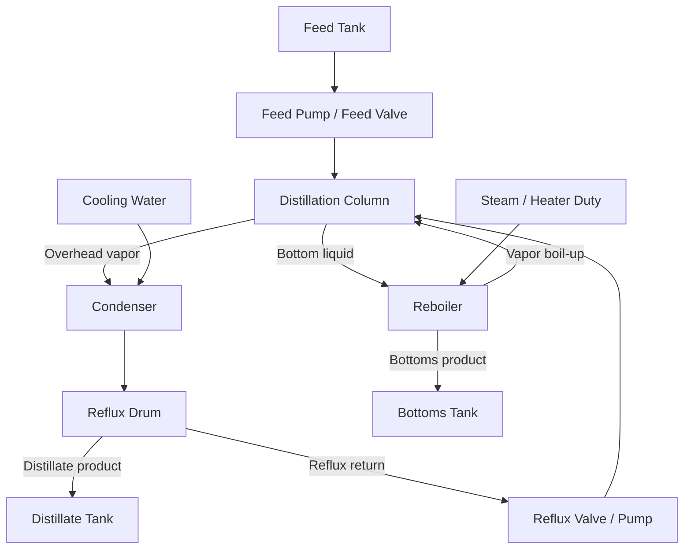

# Chemical Distillation Column Processing Introduction

适用场景：Modern Developments in Industry group assignment  
建议主题：chemical distillation column digital twin  
定位：可直接改写为 README 的 process introduction、报告正文或 demo presentation 的工艺背景部分

## 1. 为什么选择 distillation 作为 assignment 主题

Distillation（蒸馏或精馏）是化工、石化、炼油、制药、食品饮料、溶剂回收和环保处理行业中最典型、最基础、也最适合做数字孪生的工业过程之一。它不是把零件装配成一个可数的产品，而是对连续流动的液体混合物进行热力学分离：通过加热、汽化、冷凝和回流，使更易挥发的组分富集在塔顶，使较不易挥发的组分富集在塔底。

从课程的 manufacturing process 框架看，distillation 非常适合作为 chemical plant 主题，因为它同时覆盖了以下知识点：

| 课程分类维度 | Distillation 对应分类 | 说明 |
| --- | --- | --- |
| Output type | Process manufacturing | 输出通常是液体或气体等 bulk material，不是离散装配件。 |
| Flow type | Continuous 为主，batch 为辅 | 石化和大宗化工常连续运行；制药、精细化工和实验规模可采用 batch distillation。 |
| Raw-material handling | Analytic processing | 一个 feed mixture 被分离成 overhead distillate 和 bottom product，相当于一个输入拆分为多个输出。 |
| Customer order point | MTS 或 MTO | 大宗溶剂、燃料、基础化学品多为 make-to-stock；特殊配方、精细化学品可按订单或 campaign 生产。 |
| Industry role | Intermediate / capital-intensive process | 蒸馏常位于价值链中间，给下游反应、配方、包装或销售提供合格原料。 |

这个主题也很贴合 assignment brief 中的要求：它有明确的 field devices（温度、压力、液位、流量、成分分析仪）、有明显的 actuators（阀门、泵、加热器、冷却水阀）、有可解释的 PLC control logic（PID、interlock、state machine），也很容易设计 realistic faults（传感器漂移、阀门卡滞、进料扰动、MQTT 数据中断）。因此，distillation 不只是一个化学单元操作，也可以完整展示 Industry 4.0 的 stack：process model -> PLC -> broker -> historian -> dashboard -> AI operator assistant。

## 2. Industry detail: distillation 在真实工业中的位置

在真实工厂中，distillation column 通常不是孤立设备，而是生产系统中的关键 separation unit。很多化工产品的制造逻辑可以概括为：

```text
Raw materials -> Reaction / mixing / extraction -> Distillation separation -> Storage -> Downstream use or shipment
```

也就是说，蒸馏经常承担“提纯”“回收”“切割馏分”“去除杂质”这些功能。常见行业应用包括：

| 行业 | Distillation 用途 | 典型例子 |
| --- | --- | --- |
| Petrochemical | 分离轻重组分，回收溶剂，提纯中间体 | benzene/toluene/xylene separation, solvent recovery |
| Oil refining | 分馏 crude oil 或中间馏分 | naphtha, kerosene, diesel fractions |
| Pharmaceutical | 去除溶剂、回收昂贵溶剂、纯化中间体 | ethanol, acetone, isopropanol recovery |
| Food and beverage | 分离酒精、水和挥发性香味组分 | ethanol-water distillation |
| Specialty chemicals | 小批量或 campaign 式分离 | monomer purification, high-purity solvent production |
| Environmental / utilities | VOC recovery, wastewater solvent stripping | contaminated solvent/water separation |

对于 assignment，建议不要选择 refinery-scale crude distillation，因为真实原油分馏塔非常大，包含多个 side draws、pump-around circuits 和复杂 heat integration，解释难度高。更适合选择一个 continuous binary distillation column，例如 ethanol-water 或 light-heavy solvent mixture。它保留了真实工业控制的核心逻辑，同时足够简单，便于在 demo 中实现、解释和故障注入。

## 3. Process principle: distillation 的基本机理

Distillation 的基本原理是 relative volatility（相对挥发度）。在一个液体混合物中，不同组分的沸点和挥发性不同。更易挥发的组分在加热时更容易进入 vapor phase；较难挥发的组分更倾向于留在 liquid phase。通过让 vapor 和 liquid 在塔内反复接触，系统可以逐步提高分离效果。

在一个典型精馏塔中：

- Feed mixture 从塔中部进入。
- Reboiler 在塔底提供热量，使底部液体部分汽化。
- 上升 vapor 与向下流动的 liquid reflux 在 trays 或 packing 中接触。
- 轻组分逐渐向塔顶富集。
- 重组分逐渐向塔底富集。
- 塔顶 vapor 进入 condenser，被冷却成 liquid。
- 一部分冷凝液作为 distillate 产品取出。
- 另一部分冷凝液作为 reflux 返回塔顶，提高分离效率。
- 塔底液体作为 bottoms 产品取出。

可以用下面的简化图理解：



### 3.1 Main energy logic

Distillation 是一个能耗很高的 separation process。它的核心不是机械加工，而是 energy-driven separation：

- Reboiler duty 增加时，塔底产生更多 vapor，塔内 vapor flow 增强，分离能力可能提高，但能耗、压力和 flooding 风险也会增加。
- Condenser duty 增加时，塔顶 vapor 更容易冷凝，压力通常下降，reflux drum level 可能上升。
- Reflux ratio 增加时，更多液体返回塔内，分离效果通常变好，但能耗和内部液体负荷增加。
- Feed flow 或 feed composition 改变时，塔内 thermal balance 和 material balance 都会被扰动，产品纯度可能下降。

因此，一个 distillation digital twin 不能只模拟“液位变化”，还需要至少体现 temperature、pressure、flow、level 和 composition proxy 之间的耦合。

### 3.2 Key operating variables

Distillation column 的关键变量可以分成 process variables、manipulated variables 和 controlled variables。

| 变量类型 | 典型变量 | 工业意义 |
| --- | --- | --- |
| Process variables | Top temperature, bottom temperature, column pressure, reflux drum level, bottom level, feed flow | 描述塔当前状态，是 PLC、dashboard 和 AI assistant 判断工况的基础。 |
| Manipulated variables | Reboiler duty, condenser cooling valve, reflux valve, distillate valve, bottoms valve, feed valve | 控制系统可以直接调节的对象。 |
| Controlled variables | Product purity proxy, pressure, levels, temperature profile | 工厂真正想稳定的目标。 |
| Disturbances | Feed composition, feed temperature, feed flow surge, cooling water limitation | 外部扰动，不由控制器直接决定，但必须被控制系统处理。 |

在一个简化模型中，可以用 top temperature 代表 overhead product purity 的 proxy。对于二元混合物，如果 light component 纯度下降，top temperature 往往会偏离正常值。Bottom temperature 可以作为 heavy component concentration 的 proxy。虽然真实过程需要 VLE data 和 composition analyzer，但 assignment demo 可以用温度和物料平衡构建可解释的近似模型。

## 4. Simplified digital twin process design

### 4.1 Digital twin 的目标

本项目中的 digital twin 不是为了做真实 plant design，而是为了构建一个“行为可信”的教学级过程模型。它应满足：

- 正常工况下，关键变量稳定在合理范围内。
- 操作变量变化后，过程变量有动态响应，而不是瞬间跳变。
- 故障注入后，过程表现符合工业直觉。
- PLC 可以通过 on/off、PID 和 state machine 控制它。
- Dashboard 可以显示 live state、trends 和 alarms。
- AI assistant 可以根据 tag 数据解释故障并推荐 operator actions。

### 4.2 Recommended simulated process

建议模拟一个 continuous binary distillation column：

- Feed mixture：light component + heavy component。
- Example naming：ethanol-water 或 Component A / Component B。
- Target operation：
  - Overhead distillate 富含 light component。
  - Bottoms product 富含 heavy component。
  - Column operates continuously after startup。

建议采用 generic binary mixture，而不是在代码中强绑定真实危险化学品。这样 viva 时可以解释为“the model represents a simplified solvent separation column”，避免陷入真实物性、安全许可和复杂 VLE 数据。

### 4.3 Major equipment blocks

| Equipment | Role in process | Digital twin state |
| --- | --- | --- |
| Feed tank | 储存进料混合物，提供 feed source | Feed tank level, feed composition, feed temperature |
| Feed pump / feed valve | 控制 feed flow into column | Pump command, pump feedback, feed flow |
| Preheater | 可选，用于使 feed 接近塔内温度 | Feed temperature response |
| Distillation column | 核心分离设备 | Top temp, mid temp, bottom temp, pressure, separation quality |
| Reboiler | 提供 boil-up vapor | Reboiler duty, bottom temp, vapor generation |
| Condenser | 冷凝 overhead vapor | Cooling valve, cooling water flow, top pressure |
| Reflux drum | 收集冷凝液并分配 reflux/distillate | Reflux drum level |
| Reflux valve / pump | 控制 reflux return | Reflux command, reflux flow |
| Distillate valve | 控制塔顶产品流出 | Distillate flow, distillate tank level |
| Bottoms valve | 控制塔底产品流出 | Bottoms flow, bottom sump level |
| Product tanks | 存储产品 | Distillate tank level, bottoms tank level |

## 5. Simplified process model

### 5.1 Model assumptions

为了让模型可实现、可解释、可演示，建议使用如下简化：

- 用 binary mixture 表示所有分离行为。
- 不做严格 thermodynamic equilibrium calculation。
- 用 first-order dynamic response 表示 temperature、pressure 和 purity proxy 的变化。
- 用 mass balance 表示 tank levels、reflux drum level 和 bottom sump level。
- 用 top temperature / purity proxy 作为分离质量指标。
- 用 PID output saturation、temperature deviation 和 flow mismatch 触发 alarm。

这些简化是合理的，因为 assignment 的重点不是 chemical process simulator 的精度，而是完整 Industry 4.0 stack、控制逻辑、故障检测和 AI operator assistance。

### 5.2 Suggested state variables

| State variable | Meaning |
| --- | --- |
| `feed_tank_level` | Feed tank inventory |
| `feed_composition_light` | 进料中 light component fraction |
| `feed_flow` | 实际进料流量 |
| `top_temperature` | 塔顶温度，作为 light product purity proxy |
| `mid_temperature` | 塔中部温度，反映 feed zone balance |
| `bottom_temperature` | 塔底温度，反映 heavy product concentration |
| `column_pressure` | 塔压 |
| `reflux_drum_level` | 冷凝液缓冲罐液位 |
| `bottom_sump_level` | 塔底液位 |
| `reflux_flow` | 回流流量 |
| `distillate_flow` | 塔顶产品流量 |
| `bottoms_flow` | 塔底产品流量 |
| `purity_proxy` | 可选产品纯度估算值 |
| `separation_efficiency` | 可选分离效率指标 |

### 5.3 Mass balance examples

Tank 和 drum level 可以用简单离散时间物料衡算：

```text
feed_tank_level[t+dt] =
    feed_tank_level[t] - feed_flow * dt

reflux_drum_level[t+dt] =
    reflux_drum_level[t] + condensate_flow * dt
    - reflux_flow * dt - distillate_flow * dt

bottom_sump_level[t+dt] =
    bottom_sump_level[t] + liquid_downflow * dt
    - bottoms_flow * dt

distillate_tank_level[t+dt] =
    distillate_tank_level[t] + distillate_flow * dt

bottoms_tank_level[t+dt] =
    bottoms_tank_level[t] + bottoms_flow * dt
```

Demo 中不需要每个变量都严格守恒，但关键是故障发生时趋势要合理。例如 reflux valve stuck closed 时，reflux_flow 下降，top_temperature 上升，purity_proxy 下降，reflux drum level 上升或 distillate flow 异常。

### 5.4 Temperature dynamics

Temperature response 可以用 first-order lag：

```text
top_temperature[t+dt] =
    top_temperature[t]
    + (target_top_temperature - top_temperature[t]) * dt / tau_top

bottom_temperature[t+dt] =
    bottom_temperature[t]
    + (target_bottom_temperature - bottom_temperature[t]) * dt / tau_bottom
```

其中 target temperature 可以受以下因素影响：

```text
target_top_temperature =
    base_top_temperature
    + k_feed_comp * feed_composition_disturbance
    + k_feed_flow * feed_flow_deviation
    - k_reflux * reflux_flow
    + k_pressure * pressure_deviation

target_bottom_temperature =
    base_bottom_temperature
    + k_reboiler * reboiler_duty
    + k_feed_flow * feed_flow_deviation
    + k_comp * feed_composition_disturbance
```

这个模型足够表达工程直觉：

- 回流增加，塔顶温度更接近目标，分离改善。
- 进料变重或进料流量上升，塔负荷增加，温度 profile 偏移。
- 再沸器 duty 增加，bottom temperature 和 vapor generation 上升。
- 冷凝不足，pressure 上升，并影响 top temperature。

### 5.5 Pressure dynamics

Column pressure 可以与 vapor generation 和 condenser capacity 相关：

```text
pressure_trend =
    + vapor_generation_from_reboiler
    + feed_vapor_load
    - condenser_cooling_effect
    - vent_or_pressure_relief_effect
```

简化实现：

```text
column_pressure[t+dt] =
    column_pressure[t]
    + (base_pressure
       + a * reboiler_duty
       + b * feed_flow
       - c * condenser_valve_opening
       - column_pressure[t]) * dt / tau_pressure
```

High pressure 是很适合演示的 safety-critical alarm。PLC 应该本地处理 high-high pressure interlock，而不是等待 AI assistant 决策。

## 6. Sensors, actuators, and tag namespace

以下 normal ranges 是 coursework simulation ranges，不是真实工厂设计值。真实设备需要根据物料、安全等级、设计压力、HAZOP 和仪表规格确定。

### 6.1 Recommended sensors

| Tag | Measurement | Unit | Normal range | Alarm example | Purpose |
| --- | --- | --- | --- | --- | --- |
| `DT101.PV.FEED_TANK_LEVEL` | Feed tank level | % | 20-90 | Low < 10 | 防止 feed pump dry-run。 |
| `DT101.PV.FEED_FLOW` | Feed flow | L/min | 8-12 | High > 15 | 进料扰动检测和 flow control。 |
| `DT101.PV.FEED_TEMP` | Feed temperature | degC | 25-45 | High > 60 | 识别 feed thermal disturbance。 |
| `DT101.PV.FEED_X_LIGHT` | Feed light component fraction | fraction | 0.45-0.55 | Deviation > 0.10 | 模拟 composition disturbance。 |
| `DT101.PV.TOP_TEMP` | Top tray temperature | degC | 76-82 | High > 85 | 产品纯度 proxy 和 reflux control。 |
| `DT101.PV.MID_TEMP` | Middle column temperature | degC | 84-92 | High > 96 | 反映 feed zone 状态。 |
| `DT101.PV.BOTTOM_TEMP` | Bottom/reboiler temperature | degC | 96-104 | High > 110 | Reboiler duty control 和 bottoms quality。 |
| `DT101.PV.COLUMN_PRESSURE` | Column pressure | kPa | 95-115 | High > 125, HH > 140 | Condenser control 和 safety interlock。 |
| `DT101.PV.REFLUX_DRUM_LEVEL` | Reflux drum level | % | 40-60 | Low < 20, High > 80 | Distillate/reflux balance。 |
| `DT101.PV.BOTTOM_LEVEL` | Bottom sump level | % | 40-65 | Low < 20, High > 85 | Bottoms valve control。 |
| `DT101.PV.REFLUX_FLOW` | Reflux flow | L/min | 4-8 | Low < 2 | 检测 reflux valve/pump fault。 |
| `DT101.PV.DISTILLATE_FLOW` | Distillate product flow | L/min | 3-6 | Low < 1 | 产品输出监测。 |
| `DT101.PV.BOTTOMS_FLOW` | Bottoms product flow | L/min | 3-6 | Low < 1 | 物料平衡监测。 |
| `DT101.PV.COOLING_WATER_FLOW` | Condenser cooling water flow | L/min | 15-30 | Low < 10 | Condenser performance。 |
| `DT101.PV.PURITY_PROXY` | Distillate purity estimate | % | 92-98 | Low < 90 | 产品质量 proxy。 |
| `DT101.PV.PUMP_CURRENT` | Feed/reflux pump current | A | 1-5 | Low/High abnormal | 设备健康与 command-feedback 对比。 |

### 6.2 Recommended actuators

| Tag | Actuator | Signal type | Normal range | Function |
| --- | --- | --- | --- | --- |
| `DT101.CMD.FEED_PUMP` | Feed pump command | Boolean | ON/OFF | 启停进料泵。 |
| `DT101.CMD.FEED_VALVE` | Feed control valve | % open | 0-100 | 调节进料流量。 |
| `DT101.CMD.REBOILER_DUTY` | Reboiler heater/steam valve | % | 0-100 | 控制 bottom temperature 和 vapor generation。 |
| `DT101.CMD.CONDENSER_VALVE` | Cooling water valve | % | 0-100 | 控制 pressure 或 top temperature。 |
| `DT101.CMD.REFLUX_VALVE` | Reflux valve | % | 0-100 | 控制 reflux ratio 和 top product quality。 |
| `DT101.CMD.DISTILLATE_VALVE` | Distillate outlet valve | % | 0-100 | 控制 reflux drum level。 |
| `DT101.CMD.BOTTOMS_VALVE` | Bottoms outlet valve | % | 0-100 | 控制 bottom sump level。 |
| `DT101.CMD.ESD_SHUTDOWN` | Emergency shutdown command | Boolean | TRUE/FALSE | 高压、超温、液位危险时触发安全动作。 |

### 6.3 Tag namespace pattern

建议使用统一命名：

```text
<UNIT>.<CATEGORY>.<TAG_NAME>
```

其中：

- `DT101` = distillation column unit 101。
- `PV` = process variable。
- `SP` = setpoint。
- `CMD` = controller command。
- `FB` = actuator feedback。
- `ALARM` = alarm or event。
- `STATE` = operating state。
- `FAULT` = injected fault state。
- `HEARTBEAT` = infrastructure health signal。

Examples：

```text
DT101.PV.TOP_TEMP
DT101.SP.TOP_TEMP
DT101.CMD.REFLUX_VALVE
DT101.FB.REFLUX_VALVE_POSITION
DT101.ALARM.TOP_TEMP_DEVIATION
DT101.ALARM.HIGH_PRESSURE
DT101.STATE.MODE
DT101.FAULT.SENSOR_TOP_TEMP_DRIFT
DT101.HEARTBEAT.PLC
DT101.HEARTBEAT.MQTT
```

每个 tag dictionary entry 应至少包含：

- Tag name。
- Description。
- Unit。
- Data type。
- Normal range。
- Alarm limits。
- Source layer，例如 simulator、PLC、broker、historian。
- Sample rate。
- Dashboard display group。
- Whether AI assistant can use it for reasoning。

## 7. PLC control logic

### 7.1 PLC scan-cycle view

根据 PLC fundamentals 课件，PLC 的核心思维方式是 scan cycle：

```text
Read inputs -> Execute logic -> Update outputs
```

在本项目中：

- Read inputs：读取温度、压力、液位、流量、设备反馈、fault flags。
- Execute logic：运行 state machine、PID loops、interlocks、alarm detection。
- Update outputs：写入 valve commands、pump commands、reboiler duty、shutdown signal。

这使得系统具有 deterministic behavior。AI assistant 不应该直接控制安全相关 actuator；AI 的角色是解释和建议。真正的 fast control 和 safety interlock 应留在 PLC/edge control layer。

### 7.2 State machine

建议实现以下 operation modes：

| State | Description | Transition condition |
| --- | --- | --- |
| `IDLE` | 系统停机，所有主要 actuator 关闭。 | Operator presses start and feed tank level is sufficient。 |
| `FILLING` | 打开 feed pump/valve，使塔和 reboiler 建立最低液位。 | Bottom level reaches startup threshold。 |
| `STARTUP_HEATING` | 提升 reboiler duty，使塔建立 vapor flow。 | Bottom temp and pressure enter startup range。 |
| `STABILIZING` | 开始 condenser 和 reflux，等待温度 profile 稳定。 | Top/bottom temperatures near setpoints for defined time。 |
| `NORMAL_OPERATION` | PID loops fully active，持续生产。 | No active trip-level alarm。 |
| `FAULT_HANDLING` | 发生 sensor/equipment/process fault，限制输出并报警。 | Fault cleared or escalated。 |
| `SHUTDOWN` | 停 feed，降 reboiler duty，保持 cooling，安全停车。 | Operator reset after safe condition。 |

### 7.3 PID loops

建议至少实现 3 到 5 个 PID 或 PID-like loops：

| Loop | Controlled variable | Manipulated variable | Purpose |
| --- | --- | --- | --- |
| `PIC101` | Column pressure | Condenser cooling valve | 防止高压，维持稳定 VLE 条件。 |
| `TIC101` | Bottom temperature | Reboiler duty | 控制 boil-up 和 bottoms separation。 |
| `TIC102` | Top temperature / purity proxy | Reflux valve | 稳定 overhead product quality。 |
| `LIC101` | Reflux drum level | Distillate valve | 防止 reflux drum overfill 或 empty。 |
| `LIC102` | Bottom sump level | Bottoms valve | 保持 reboiler 液位稳定。 |

### 7.4 Interlocks and safety logic

PLC 应实现本地 safety/interlock：

- If `COLUMN_PRESSURE > HH_LIMIT`:
  - trigger `ALARM.HIGH_HIGH_PRESSURE`
  - reduce `REBOILER_DUTY` to 0
  - open `CONDENSER_VALVE` to 100
  - stop feed if pressure keeps rising
  - transition to `SHUTDOWN`
- If `FEED_TANK_LEVEL < LOW_LOW_LIMIT`:
  - stop feed pump
  - raise dry-run protection alarm
- If `BOTTOM_LEVEL < LOW_LOW_LIMIT`:
  - reduce reboiler duty to avoid dry heating
- If `REFLUX_DRUM_LEVEL > HIGH_HIGH_LIMIT`:
  - open distillate valve
  - reduce condenser load if needed
- If sensor signal stale:
  - mark control quality degraded
  - do not allow automatic startup

### 7.5 Example structured-text style logic

```text
IF Mode = NORMAL_OPERATION THEN
    PIC101(ColumnPressure, PressureSP, CondenserValveCmd);
    TIC101(BottomTemp, BottomTempSP, ReboilerDutyCmd);
    TIC102(TopTemp, TopTempSP, RefluxValveCmd);
    LIC101(RefluxDrumLevel, RefluxDrumLevelSP, DistillateValveCmd);
    LIC102(BottomLevel, BottomLevelSP, BottomsValveCmd);
END_IF;

IF ColumnPressure > PressureHH THEN
    AlarmHighHighPressure := TRUE;
    ReboilerDutyCmd := 0;
    CondenserValveCmd := 100;
    FeedPumpCmd := FALSE;
    Mode := SHUTDOWN;
END_IF;

IF FeedTankLevel < FeedTankLL THEN
    AlarmFeedTankLowLow := TRUE;
    FeedPumpCmd := FALSE;
END_IF;
```

## 8. Fault injection scenarios

Assignment 要求每组实现 four faults, one per layer。Distillation column 可以很自然地设计这些 faults。

### 8.1 Sensor layer fault: top temperature sensor drift

| Item | Design |
| --- | --- |
| Fault trigger | Inject `FAULT.SENSOR_TOP_TEMP_DRIFT = TRUE` after normal operation is stable。 |
| Physical meaning | Top temperature transmitter calibration drifts slowly upward or downward。 |
| Expected symptoms | Reported top temperature deviates from expected temperature inferred from pressure, reflux command and purity proxy。 |
| Detection logic | If top temp trend changes but pressure, reflux flow and purity proxy do not support that change, flag possible sensor drift。 |
| Alarm | `DT101.ALARM.TOP_TEMP_SENSOR_DRIFT` |
| Dashboard display | Trend top temperature against pressure, reflux valve command and purity proxy。 |
| AI recommendation | “Top temperature signal appears inconsistent. Cross-check with pressure and product purity proxy. Do not overcorrect reflux until instrument condition is verified.” |
| Safe operator action | Switch to validated backup estimate if available; inspect transmitter calibration; keep column under conservative operation。 |

为什么这个 fault 好：它体现了 sensors lecture 中 calibration、accuracy、drift、measurement uncertainty 的重要性，也能展示 AI assistant 不应该盲目相信单个 tag。

### 8.2 Equipment layer fault: reflux valve stuck partially closed

| Item | Design |
| --- | --- |
| Fault trigger | Command reflux valve to 60%, but actual feedback is stuck at 20%。 |
| Physical meaning | Pneumatic valve stiction, actuator air issue, valve positioner problem, or mechanical blockage。 |
| Expected symptoms | Reflux flow lower than expected, top temperature rises, purity proxy drops, controller output saturates。 |
| Detection logic | Command-vs-feedback mismatch and reflux flow-vs-command divergence for more than defined seconds。 |
| Alarm | `DT101.ALARM.REFLUX_VALVE_STUCK` |
| Dashboard display | Reflux command, valve feedback, reflux flow, top temperature, purity proxy。 |
| AI recommendation | “Reflux valve is not following command. Product quality is at risk. Check valve air supply/positioner; reduce feed or move to safe operation.” |
| Safe operator action | Reduce feed load, verify valve feedback, switch to manual or backup path if modeled, avoid increasing reboiler duty aggressively。 |

为什么这个 fault 好：它对应 sensors and actuators lecture 中 actuator feedback、position monitoring、command-vs-feedback mismatch，也适合在 live demo 中清楚展示。

### 8.3 Process layer fault: feed composition disturbance

| Item | Design |
| --- | --- |
| Fault trigger | Feed light component fraction changes from 0.50 to 0.40 or 0.60。 |
| Physical meaning | Upstream batch change, wrong feed tank, poor mixing, or raw material quality variation。 |
| Expected symptoms | Top/bottom temperature profile shifts, purity proxy falls, PID loops compensate, reflux and reboiler commands increase。 |
| Detection logic | Product purity proxy below limit plus temperature profile deviation and controller output saturation。 |
| Alarm | `DT101.ALARM.FEED_COMPOSITION_DISTURBANCE` |
| Dashboard display | Feed composition estimate, top/bottom temperature, purity proxy, reflux command, reboiler duty。 |
| AI recommendation | “Feed composition disturbance detected. Increase monitoring of product quality, reduce feed rate if purity remains low, and verify upstream feed source.” |
| Safe operator action | Lower feed rate, adjust reflux/reboiler within safe limits, divert off-spec product if product tank logic exists。 |

为什么这个 fault 好：它能展示 process manufacturing 中 feed quality 和 continuous process control 的耦合，也让 AI assistant 有机会解释 cause-effect chain。

### 8.4 Infrastructure layer fault: MQTT broker outage or historian staleness

| Item | Design |
| --- | --- |
| Fault trigger | Stop publishing tags to broker, delay messages, or pause historian writes。 |
| Physical meaning | Network failure, broker crash, historian outage, edge-to-cloud connectivity issue。 |
| Expected symptoms | Dashboard values freeze or timestamps become stale while PLC simulation may still be running。 |
| Detection logic | Heartbeat missing, last update age exceeds threshold, data staleness alarm; distinguish stale data from actual process alarm。 |
| Alarm | `DT101.ALARM.DATA_STALE` or `DT101.ALARM.BROKER_OFFLINE` |
| Dashboard display | Last-update timestamp, heartbeat status, tag freshness indicator。 |
| AI recommendation | “Data path appears stale. Do not interpret frozen trends as stable operation. Verify PLC local status and restore broker/historian connection.” |
| Safe operator action | Rely on local HMI/PLC alarms, avoid remote-only decisions, restore broker or historian service。 |

为什么这个 fault 好：它直接对应 Industry 4.0 / IIoT stack，能说明 data-driven manufacturing 依赖 connectivity，但 safety control 必须保留在 edge/PLC。

## 9. Dashboard and historian design

### 9.1 Dashboard pages

建议 dashboard 至少分为四个 views：

1. Process overview
   - Column diagram。
   - Main live values：top temp、bottom temp、pressure、levels、flows。
   - Current mode and alarm banner。

2. Trends
   - Top/mid/bottom temperature trend。
   - Column pressure。
   - Reboiler duty and condenser valve。
   - Reflux command, reflux flow and purity proxy。

3. Fault injection panel
   - Sensor drift。
   - Reflux valve stuck。
   - Feed composition disturbance。
   - MQTT/historian outage。

4. AI assistant panel
   - Active alarm。
   - Evidence used。
   - Recommended action。
   - Safety note。
   - Confidence / uncertainty statement。

### 9.2 Historian sample rates

| Tag group | Suggested sample rate | Reason |
| --- | --- | --- |
| Temperature, pressure, level | 1 s | Main process trends and alarms。 |
| Flow and actuator commands | 1 s | Detection of command-vs-response faults。 |
| Heartbeat and infrastructure | 1 s or 5 s | Detect staleness quickly enough for demo。 |
| Product purity proxy | 2-5 s | Composition changes are slower。 |
| Alarm events | Event-based | Store exact fault time and recovery time。 |

For demo, all fault detection should happen within 60 seconds after injection, matching assignment requirement.

## 10. AI operator assistant design

The AI assistant should not be a black-box controller. It should act as an operator support tool that reads current tags, alarms, recent trends and fault catalog rules, then produces plain-language recommendations.

### 10.1 Inputs to AI assistant

- Active alarms。
- Current mode。
- Last 60-120 seconds of key trends。
- Current setpoints and actual values。
- Fault catalog。
- Safety rules, such as “never recommend bypassing high-pressure interlock”。
- Data freshness information。

### 10.2 Recommended response format

```text
Fault summary:
Evidence:
Likely cause:
Immediate operator action:
Follow-up check:
Safety caution:
```

### 10.3 Example AI response for reflux valve stuck

```text
Fault summary:
The reflux valve appears stuck partially closed.

Evidence:
The reflux valve command increased from 45% to 70%, but valve feedback remained near 20%.
Reflux flow dropped below normal and top temperature is rising above its target.
The purity proxy is also trending downward.

Likely cause:
The valve actuator, positioner, air supply, or mechanical valve body may be failing.

Immediate operator action:
Reduce feed rate to lower column load and prevent off-spec distillate.
Ask field technician to check reflux valve air supply and position feedback.

Follow-up check:
Monitor top temperature, reflux flow and purity proxy for recovery.

Safety caution:
Do not increase reboiler duty to compensate. That may increase pressure and worsen separation instability.
```

## 11. Architecture integration with assignment stack

The complete architecture can be described as:

```text
Digital process simulator
    -> simulated sensors and actuators
    -> PLC/control layer
    -> MQTT or OPC-UA broker
    -> historian/time-series database
    -> dashboard
    -> AI assistant
```

Layer interpretation:

| Layer | Role |
| --- | --- |
| Field/device layer | Simulated sensors, actuators and equipment behavior。 |
| PLC/control layer | Deterministic control, PID, state machine, interlocks, alarm generation。 |
| Communication layer | MQTT/OPC-UA publishes tags upward and accepts safe commands if needed。 |
| Historian layer | Stores time-series process data, alarms and events。 |
| Dashboard/SCADA layer | Operator visualization, trends, alarms and manual fault injection。 |
| AI assistant layer | Interprets trends and alarms, recommends safe operator actions。 |

This shows the course theme clearly: Industry 4.0 is not just adding AI. It is the integration of physical process, instrumentation, deterministic control, industrial communication, data history, visualization and decision support.

## 12. Suggested demo narrative

During presentation, the team can explain the process in this order:

1. Distillation is a process manufacturing operation used to separate a liquid mixture by volatility.
2. The twin models a simplified continuous binary distillation column.
3. Sensors measure temperature, pressure, level, flow and quality proxy.
4. Actuators adjust feed, reboiler heat, condenser cooling, reflux, distillate and bottoms withdrawal.
5. PLC controls the process using state machine, PID loops and safety interlocks.
6. MQTT/OPC-UA carries structured tags to the historian and dashboard.
7. The historian stores trends for fault detection and explanation.
8. The dashboard shows live state and alarms.
9. The AI assistant explains faults and recommends safe actions.
10. Four faults are injected: sensor drift, reflux valve stuck, feed composition disturbance and data staleness.

## 13. Short version for presentation slide

Distillation is a continuous process manufacturing operation used to separate a liquid mixture into lighter overhead and heavier bottom products. It relies on relative volatility: lighter components vaporize and concentrate near the top, while heavier components remain near the bottom. A reboiler supplies heat, a condenser removes heat, and reflux improves separation. Because the process depends on temperature, pressure, flow, level and composition, it is an ideal case for a digital twin. The simulated column can be instrumented with industrial sensors, controlled by PLC-style PID and state-machine logic, connected through MQTT/OPC-UA to a historian and dashboard, and monitored by an AI assistant that detects faults and recommends operator actions.

## 14. Final positioning statement

For this assignment, the distillation column should be presented as a realistic but explainable chemical plant process. It is realistic because it appears widely in chemical and process industries, involves continuous bulk material transformation, uses industrial sensors and actuators, and requires deterministic control. It is explainable because a simplified binary column can be modeled with mass balance, first-order temperature dynamics, pressure response and clear control loops. This makes it strong for a digital twin demo: every fault has visible process symptoms, every control action has an engineering reason, and every AI recommendation can be grounded in tag data rather than vague automation language.

